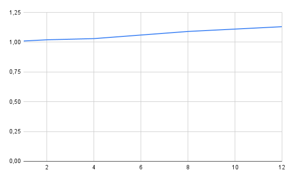
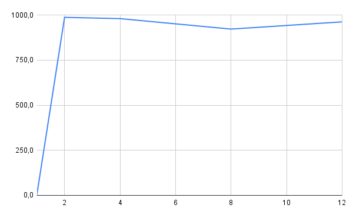
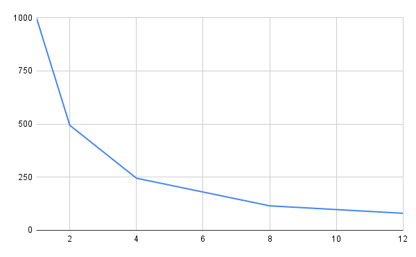

# Parallelization Analysis – Number Summation with Threads

## 1. Problem Description

**What is the program's objective?** The program's objective is to read a text file containing numerous integer values and calculate the total sum of these numbers. To improve performance, the application utilizes multiple threads to process parts of the file in parallel.

**What problem was implemented?** A data processing problem was implemented where a massive amount of numbers stored in a file must be summed. The challenge is to perform this summation efficiently using parallelization.

**Which algorithm was used?** The algorithm divides the file data among multiple threads. Each thread calculates a partial sum of its assigned numbers, and finally, all partial sums are combined to generate the final result.

**What is the processed data volume?** Tests were conducted using files with approximately 1 million and 10 million numbers, where each line of the file contains a single integer.

**What is the input size used in the tests?** The input size corresponds to the number of lines in the file. Files with 1,000,000 and 10,000,000 lines were used.

**What is the goal of parallelization?** The goal is to divide the workload among multiple threads to reduce the program's total execution time.

**What is the approximate time complexity?** The algorithm's complexity is approximately O(n), as each number in the file needs to be read and summed exactly once.

## 2. Experimental Environment

| Item | Description |
|---|---|
| Processor | Intel Core i5-12500 |
| Number of Cores | 6 |
| RAM | 16 GB |
| Operating System | Windows 11 |
| Language | Python |
| Parallelization Library | `threading` |
| IDE / Version | VS Code - Python 3.13.2 |

## 3. Testing Methodology

**How was execution time measured?** Execution time was measured using Python's built-in time measurement functions, recording timestamps at the start and end of the program's execution. The difference represents the total processing time.

**How many executions were performed?** Two executions were performed for each thread configuration to reduce potential performance variations during testing.

**Was an average time used?** Yes. For each configuration, the average time of the two executions was calculated and used for the results analysis.

**Thread Configurations Tested:**
* 1 thread (Serial version)
* 2 threads
* 4 threads
* 8 threads
* 12 threads

**Execution Conditions:** Experiments were run on a personal computer using VS Code. During testing, other programs and applications were closed to minimize interference and allocate maximum machine resources to the script.

## 4. Experimental Results

| Threads/Processes | Execution Time (s) |
|---|---|
| 1 | 1.0100565 |
| 2 | 1.027310 |
| 4 | 1.041841 |
| 8 | 1.1240425 |
| 12 | 1.090313 |

## 5. Speedup and Efficiency Calculation

**Formulas Used:**

Speedup(p) = T(1) / T(p)
* **T(1)** = Serial execution time
* **T(p)** = Execution time with p threads/processes

Efficiency(p) = Speedup(p) / p
* **p** = Number of threads or processes

## 6. Results Table

| Threads/Processes | Time (s) | Speedup | Efficiency |
|---|---|---|---|
| 1 | 1.009876 | 1.000 | 1.000 |
| 2 | 1.023370 | 0.987 | 0.494 |
| 4 | 1.030603 | 0.980 | 0.245 |
| 8 | 1.094857 | 0.922 | 0.115 |
| 12 | 1.131273 | 0.962 | 0.080 |

## 7. Execution Time Chart

---

## 8. Speedup Chart

---

## 9. Efficiency Chart

## 10. Results Analysis

**Was the obtained speedup close to the ideal?** No. The speedup was below expectations and, in some cases, less than 1, indicating the program did not run faster with more threads.

**Did the application show scalability?** No. Increasing the number of threads did not significantly reduce the execution time.

**At what point did efficiency start to drop?** Efficiency began to drop at 2 threads and continued decreasing as more threads were added.

**Did the thread count exceed physical cores?** Yes. The processor has 6 physical cores, and tests were conducted with up to 8 and 12 threads.

**Was there parallelization overhead?** Yes. Thread management and synchronization generated an additional cost that impacted performance.

**Potential Causes for Performance Loss:**
* Thread creation overhead
* File I/O reading bottlenecks
* CPU resource contention

**Algorithm Bottlenecks:**
* File reading step
* Workload division among threads

## 11. Conclusion

The results demonstrate that parallelization did not yield the expected performance gains for this specific application. In some configurations, the execution time actually increased. This was primarily due to thread overhead, the I/O bound nature of file reading, and the processor's core limitations. Nonetheless, the experiment was highly valuable for practically understanding concurrency concepts like speedup, efficiency, and the limitations of parallelism in I/O-bound tasks.
